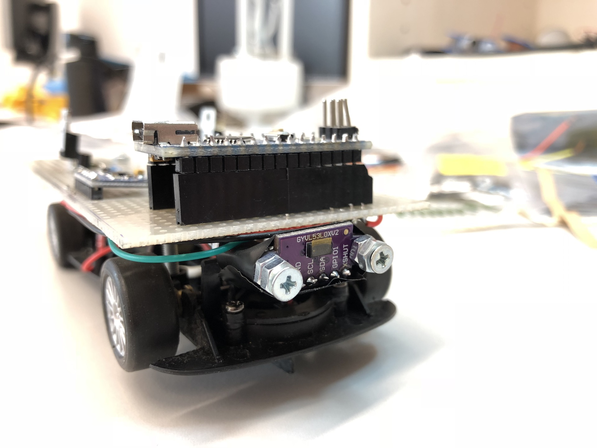
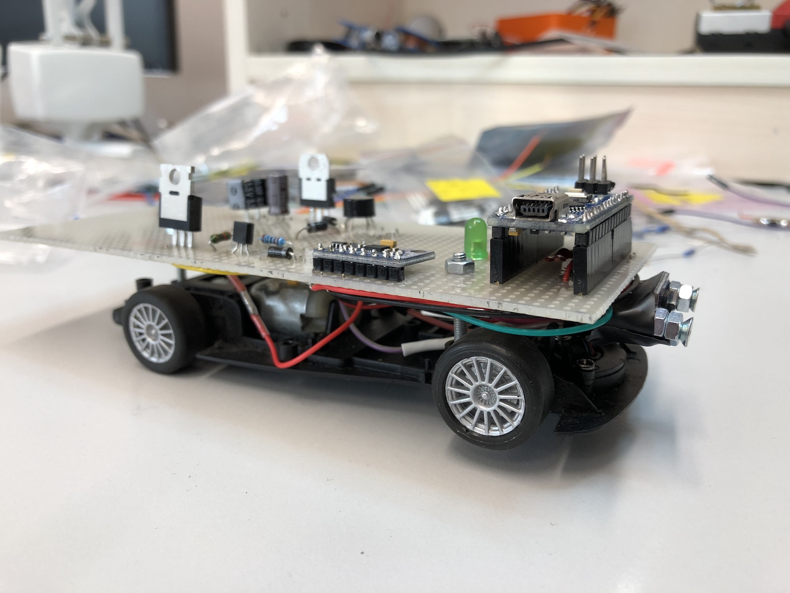
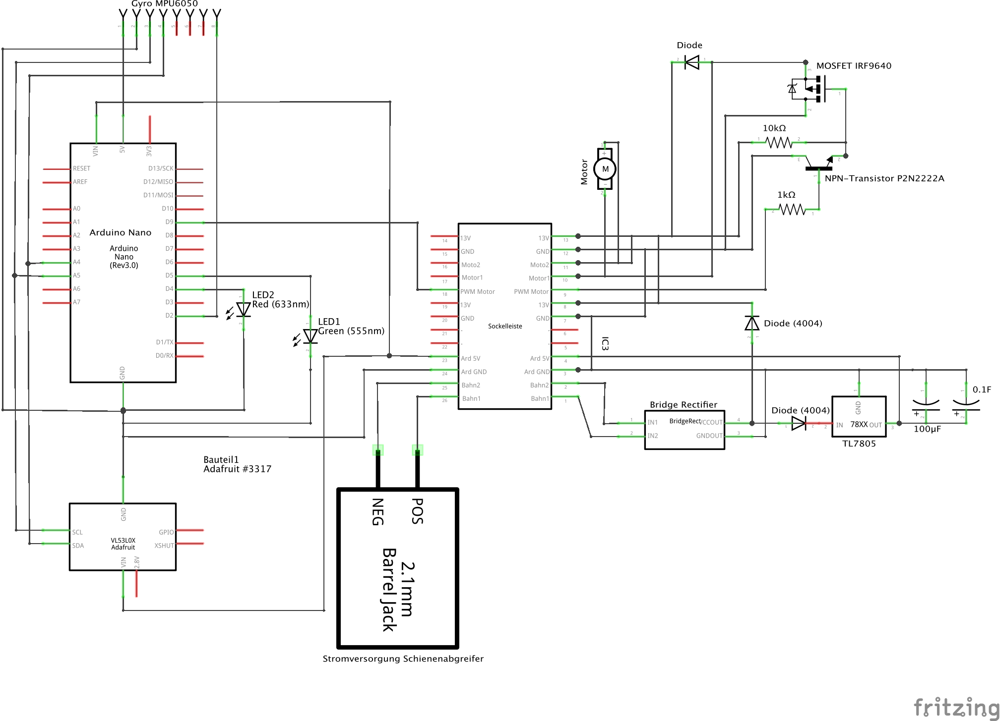

# Carrera Platooning
University project.
Implement platooning for Carrera Digital 132. The car is controlled by an Arduino Nano.

The car uses a VL53L0X time of flight sensor to detect the distance to the car driving ahead. It speeds up or slows down based on this measurements using a PID controller.

## Dependencies
The final code for diriving is at `eos17_finale_abgabe`.  
Install via Arduino library manager:
* [Adafruit_VL53L0X](https://github.com/adafruit/Adafruit_VL53L0X)
* [Arduino-PID-Library](https://github.com/br3ttb/Arduino-PID-Library)

## The Car
The circuit to control the car using the Arduino was originally built by other people before us. We made some additions:
* *diodes* for preventing the car to disturb the rail signal when the motor slows down
* a *VL53L0X time of flight sensor* for measung the distance distance to the car driving ahead

This is how the car looks like:  

Circuit diagram:

